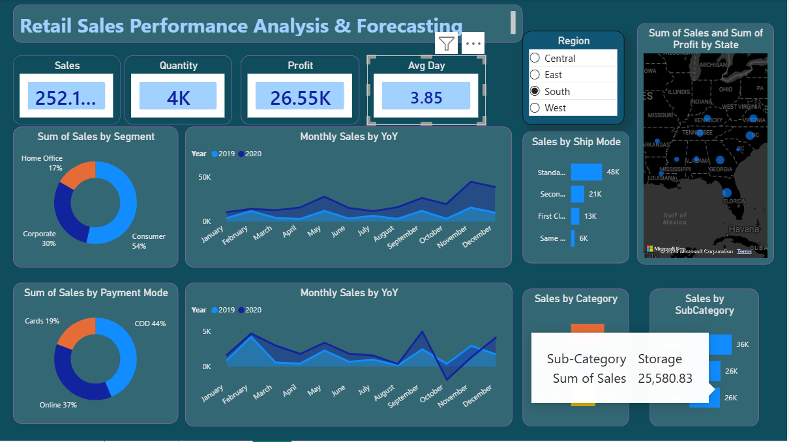
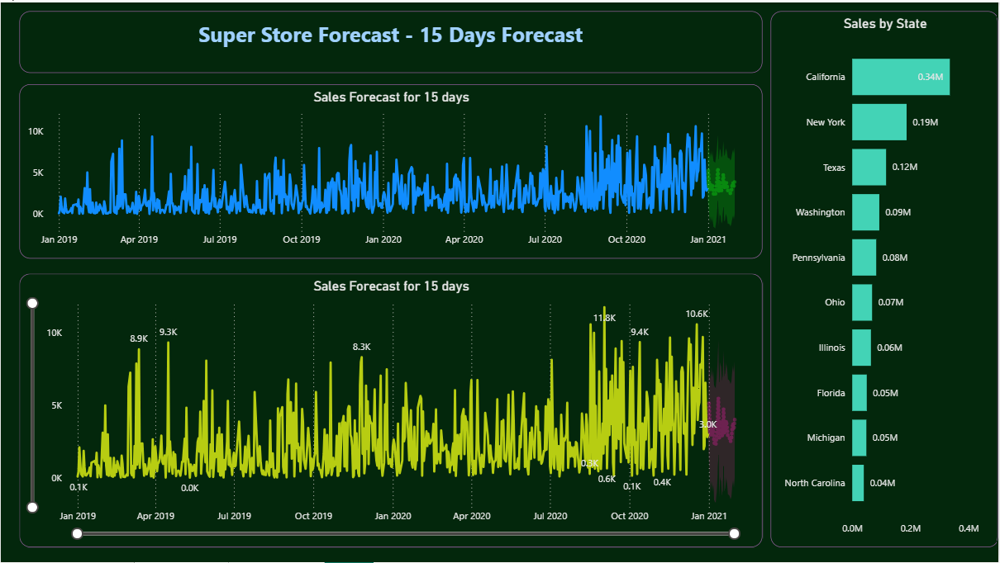

# Overview
Retail businesses generate enormous amounts of transactional data
every day. Most of it sits unused. This project turns that data
into something a decision-maker can actually act on.

Built on the Super Store sales dataset, this Power BI dashboard
covers the full picture — revenue trends, category performance,
regional breakdowns, customer segments, and shipping patterns —
all in one place. No spreadsheets, no manual reporting, no waiting.

The dashboard has two layers:

**Performance Analysis** — what has happened. Sales by category,
region, segment, and time period. Identifies which products are
driving revenue, which regions are underperforming, and where
profit margins are being lost.

**15-Day Sales Forecast** — what is likely to happen next.
Built using historical sales patterns, the forecast gives
operations and inventory teams enough lead time to act before
a demand spike or slowdown hits.

The goal was a dashboard that a non-technical stakeholder can
open, understand in under a minute, and use to make a decision —
without needing a data analyst in the room to explain it.
#  Dashboard Preview
### Sales Dashboard
  
### forecastng Dashboard
  
  

## Features

### Dashboard Page 1: Sales Performance Analysis
- *Key Metrics Cards*: Total Sales (252.1K), Quantity (4K), Profit (26.55K), Average Daily Sales (3.85)
- *Sales by Segment*: Pie chart showing distribution across Home Office, Corporate, and Consumer segments
- *Sales by Payment Mode*: Breakdown by payment methods (Cards, COD, Online)
- *Monthly Sales Trends*: Year-over-Year comparison (2019 vs 2020)
- *Geographical Analysis*: State-wise sales distribution with interactive map
- *Sales by Ship Mode*: Performance across different shipping methods
- *Sales by Category*: Product category performance analysis

### Dashboard Page 2: Sales Forecasting
- *15-Day Sales Forecast*: Predictive analytics using historical trends
- *State-wise Forecast*: Regional sales predictions
- *Sales by Ship Mode*: Shipping method analysis with forecast data

## Tools & Technologies

- *Power BI Desktop*: Dashboard creation and data visualization
- *Data Source*: CSV file containing Super Store sales data
- *Analytics*: Time series forecasting, trend analysis, YoY comparison

## Key Insights

- Sales performance segmented by customer type, region, and product category
- Monthly trends showing seasonal patterns
- Payment mode preferences
- Shipping method efficiency
- 15-day forecast for proactive inventory and resource planning

##  Data Analysis Performed

1. *Sales Trend Analysis*: Identified monthly and yearly patterns
2. *Customer Segmentation*: Analyzed performance across different customer segments
3. *Geographical Analysis*: State-wise sales distribution
4. *Payment Analysis*: Understanding customer payment preferences
5. *Predictive Modeling*: 15-day sales forecast using Power BI forecasting capabilities

##  How to Use

1. Download the .pbix file from this repository
2. Open with Power BI Desktop
3. Refresh data connections if needed
4. Interact with visualizations using filters and slicers
## Learning Outcomes

- Advanced Power BI dashboard design
- Data visualization best practices
- Sales forecasting techniques
- Interactive report development
- Business intelligence and analytics

## Author

*Chandan*
- Email: jenachandankumar773@gmail.com
- GitHub: 7735Chandanjena

